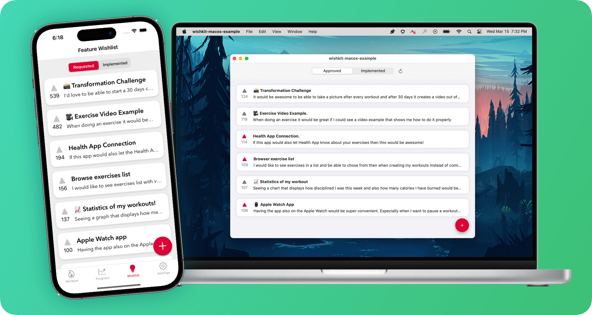

<h1 align="center"> <a href="https://www.wishkit.io/?ref=github">wishkit.io</a></h1>
<h4 align="center"> In-App Feature Requests. Made Easy. </h2>
<p align="center">
	<a href="LICENSE">
        	
	</a>
	<a href="https://swift.org">
        	
	</a>
	<a href="https://twitter.com/mywishkit" target="_blank">
        	
	</a>
</p>
<p align="center">
WishKit allows your users to request and vote on features in your app that <b>just works ✨</b> <br/>
</p>



## Index
- [Setup (UIKit)](#uikit)
- [Setup (SwiftUI)](#swiftui)
- [Theming](#theming)
- [User Segmentation](#user-segmentation)
- [Control UI Elements](#ui-elements)
- [Localization](#localization)

# UIKit

## 1. Add WishKit (v4.7.0) as a dependency in Xcode.
```
https://github.com/wishkit/wishkit-ios.git
```

## 2. Configure WishKit with your API Key.
###### You can find your API key in your admin dashboard on <a href="https://wishkit.io" target="_blank">wishkit.io</a>.
```swift
import UIKit
import WishKit

@main
class AppDelegate: UIResponder, UIApplicationDelegate {

    func application(_ application: UIApplication, didFinishLaunchingWithOptions launchOptions: [UIApplication.LaunchOptionsKey: Any]?) -> Bool {
	WishKit.configure(with: "your_api_key")
        return true
    }
    
    ...
}
```

## 3. Now you can present the WishKit viewController.
```swift
import UIKit
import WishKit

class HomeViewController: UIViewController {
    ...
  
    @objc func buttonTapped() {
        present(WishKit.viewController.withNavigation(), animated: true)  
    }
}
```
###### NOTE: If you are pushing the `WishKit.viewController`, you won't need to call `withNavigation()`.
---

# SwiftUI

## 1. Add WishKit (v4.7.0) as a dependency in Xcode.
```
https://github.com/wishkit/wishkit-ios.git
```

## 2. Configure WishKit with your API Key in the first view.
###### You can find your API key in your admin dashboard on <a href="https://wishkit.io" target="_blank">wishkit.io</a>.
```swift
import SwiftUI
import WishKit

struct ContentView: View {

    init() {
        WishKit.configure(with: "your-api-key")
    }
  
    ...
}
```

## 3. Now use the view wherever you want!
```swift
import SwiftUI
import WishKit

struct ContentView: View {

    init() {
        WishKit.configure(with: "your-api-key")
    }

    var body: some View {
        WishKit.FeedbackListView().withNavigation()
    }
}
```
###### NOTE: If one of the parent views is a NavigationView/NavigationStack, you won't need to call `withNavigation()`.

---

# Configuration
#### You can configure a lot of WishKit's UI elements.

```swift
// Allow user to undo their vote
WishKit.config.allowUndoVote = true

// Shows full description of a feature request in the list.
WishKit.config.expandDescriptionInList = true

// Hide comment section
WishKit.config.commentSection = .hide

// Position the Add-Button.
WishKit.config.buttons.addButton.bottomPadding = .large

// Show the status badge of a feature request (e.g. pending, approved, etc.).
WishKit.config.statusBadge = .show

// Hide the segmented control.
WishKit.config.buttons.segmentedControl.display = .hide

// Remove drop shadow.
WishKit.config.dropShadow = .hide

```

---

# Theming
#### You can theme WishKit to fit your apps color. 🎨

```swift
// This is for the Add-Button, Segmented Control, and Vote-Button.
WishKit.theme.primaryColor = .yellow

// Set the secondary color (this is for the cells and text fields).
WishKit.theme.secondaryColor = .set(light: .orange, dark: .red)

// Set the tertiary color (this is for the background).
WishKit.theme.tertiaryColor = .set(light: .gray, dark: .black)

// Segmented Control (Text color)
WishKit.config.buttons.segmentedControl.defaultTextColor = .setBoth(to: .white)

WishKit.config.buttons.segmentedControl.activeTextColor = .setBoth(to: .white)

// Save Button (Text color)
WishKit.config.buttons.saveButton.textColor = .set(light: .white, dark: .white)

```


---

# User Segmentation
#### 💰 Revenue Indication: Share how much a user is paying in your app.
```swift
// How much a user is paying per week or month or year.
// WishKit supports weekly, monthly and yearly payments.
WishKit.updateUser(payment: .monthly(7.99))
```
By sharing the revenue of a user you will be able to see "how much money" is behind a feature request.
This allows you to prioritize a feature with only 2 votes but $13 over a feature with 7 votes and $0.

#### 📧 Additional: Share optional user information with WishKit.
```swift
// Email
WishKit.updateUser(email: "jobs@apple.com")

// Name
WishKit.updateUser(name: "Steve")

// If you manage user IDs yourself you can let WishKit prioritize it.
WishKit.updateUser(customID: "8AHD1IL03ACIP")
```

---

# Localization
#### Localize any text used by WishKit by overriding default values.

```swift
// Override the segmented control text to the german word for "Requested".
WishKit.config.localization.requested = "Angefragt"

// You can also assign NSLocalizedString.
WishKit.config.localization.cancel = NSLocalizedString("general.cancel", comment: "")
```

### **Platforms**

- iOS 14+
- macOS 12+

---

### **Example Project**
Checkout the [example project](https://github.com/wishkit/wishkit-ios-example) to see how easy it is to set up WishKit!
