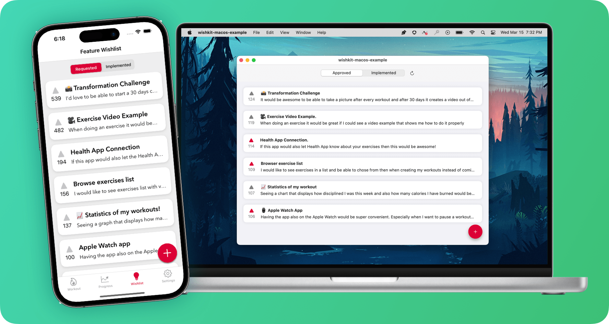

<h1 align="center"> <a href="https://www.wishkit.io/?ref=github">wishkit.io</a></h1>
<h4 align="center"> The best In-App Feature Request and Feedback Board </h2>
<p align="center">
	<a href="LICENSE">
        	
	</a>
	<a href="https://swift.org">
        	
	</a>
	<a href="https://twitter.com/mywishkit" target="_blank">
        	
	</a>
</p>
<p align="center">
WishKit allows your users to request and vote on features in your app! <br/>
</p>



## Index
- [Setup (SwiftUI)](#swiftui)
- [Theming](#theming)
- [User Segmentation](#user-segmentation)
- [Control UI Elements](#ui-elements)
- [Localization](#localization)
- [Migrating from v4 (UIKit)](#migrating-from-v4-uikit)

# SwiftUI

## 1. Add WishKit (v5.0.0) as a dependency in Xcode.
```
https://github.com/wishkit/wishkit-ios.git
```

## 2. Configure WishKit with your API Key in the first view.
###### You can find your API key in your admin dashboard on <a href="https://www.wishkit.io" target="_blank">wishkit.io</a>.
```swift
import SwiftUI
import WishKit

struct ContentView: View {

    init() {
        WishKit.configure(with: "your-api-key")
    }
  
    ...
}
```

## 3. Now use the view wherever you want!
```swift
import SwiftUI
import WishKit

struct ContentView: View {

    init() {
        WishKit.configure(with: "your-api-key")
    }

    var body: some View {
        WishKit.FeedbackListView()
    }
}
```

###### NOTE: On iOS and tvOS, `FeedbackListView` expects to live inside a `NavigationStack`. If it's not already inside one, add `.withNavigation()` to wrap it: `WishKit.FeedbackListView().withNavigation()`. On macOS, visionOS, and watchOS, `FeedbackListView` provides its own navigation container — no wrapping needed.

---

# Configuration
#### You can configure a lot of WishKit's UI elements.

```swift
// Allow user to undo their vote
WishKit.config.allowUndoVote = true

// Shows full description of a feature request in the list.
WishKit.config.expandDescriptionInList = true

// Hide comment section
WishKit.config.commentSection = .hide

// Show the status badge of a feature request (e.g. pending, approved, etc.).
WishKit.config.statusBadge = .show

// Hide the segmented control.
WishKit.config.buttons.segmentedControl.display = .hide

// Show internal debug logs in the console (network requests, errors, etc.).
// Off by default so production builds stay quiet.
WishKit.config.showDebugLogs = true

```

---

# Theming
#### You can theme WishKit to fit your apps color. 🎨

```swift
// Accent color for primary actions (Save button, active Vote-Button, comment send).
// Defaults to your app's accent color so WishKit blends in natively.
WishKit.theme.primaryColor = .yellow

// Set the secondary color (this is for the cells and text fields).
WishKit.theme.secondaryColor = .set(light: .orange, dark: .red)

// Set the tertiary color (this is for the background).
WishKit.theme.tertiaryColor = .set(light: .gray, dark: .black)

```


---

# User Segmentation
#### 💰 Revenue Indication: Share how much a user is paying in your app.
```swift
// How much a user is paying per week or month or year.
// WishKit supports weekly, monthly and yearly payments.
WishKit.updateUser(payment: .monthly(7.99))
```
By sharing the revenue of a user you will be able to see "how much money" is behind a feature request.
This allows you to prioritize a feature with only 2 votes but $13 over a feature with 7 votes and $0.

#### 📧 Additional: Share optional user information with WishKit.
```swift
// Email
WishKit.updateUser(email: "jobs@apple.com")

// Name
WishKit.updateUser(name: "Steve")

// If you manage user IDs yourself you can let WishKit prioritize it.
WishKit.updateUser(customID: "8AHD1IL03ACIP")
```

---

# Localization
#### Localize any text used by WishKit by overriding default values.

```swift
// Override the segmented control text to the german word for "Requested".
WishKit.config.localization.requested = "Angefragt"

// You can also assign NSLocalizedString.
WishKit.config.localization.cancel = NSLocalizedString("general.cancel", comment: "")
```

### **Platforms**

- iOS 16+
- macOS 13+
- visionOS 1+
- watchOS 10+
- tvOS 17+

### **Platform feature matrix**

| Feature | iOS | macOS | visionOS | watchOS | tvOS |
|---|:-:|:-:|:-:|:-:|:-:|
| Browse wishes | Yes | Yes | Yes | Yes | Yes |
| Vote / undo vote | Yes | Yes | Yes | Yes | Yes |
| Create wish | Yes | Yes | Yes | — | — |
| Read comments | Yes | Yes | Yes | — | Yes |
| Post comments | Yes | Yes | Yes | — | — |
| State filter (`buttons.segmentedControl`) | Yes | Yes | Yes | Yes | Yes |
| Done button (`buttons.doneButton`) | Yes | Yes | Yes | — | — |
| Add button (`buttons.addButton`) | Yes | Yes | Yes | — | — |

watchOS and tvOS are intentionally scoped to browse + vote. Config keys for unsupported features are silently ignored on those platforms. On tvOS, users dismiss the feedback view via the Siri Remote's Menu button (the standard system pattern), so `buttons.doneButton` is not exposed.

On watchOS and tvOS, the state filter is rendered as a single cycle button that loops through the available states on tap — a more remote- and crown-friendly affordance than a segmented control.

---

### **Example Project**
Checkout the [example project](https://github.com/wishkit/wishkit-ios-example) to see how easy it is to set up WishKit!

---

# Migrating from v4 (UIKit)

WishKit 5 is SwiftUI-only. The `WishKit.viewController` entry point that existed in v4 has been removed. If you were presenting `WishKit.viewController.withNavigation()` from a `UIViewController`, switch to wrapping the SwiftUI view yourself:

```swift
import UIKit
import SwiftUI
import WishKit

class HomeViewController: UIViewController {

    @objc func buttonTapped() {
        let feedback = UIHostingController(rootView: WishKit.FeedbackListView().withNavigation())
        present(feedback, animated: true)
    }
}
```

Everything else — `WishKit.configure(_:)`, `WishKit.config`, `WishKit.theme`, `WishKit.updateUser(...)` — works the same as before.
